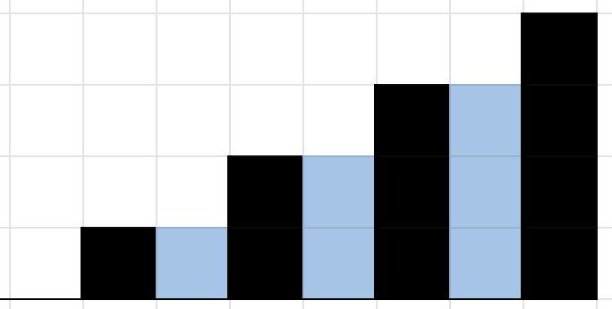
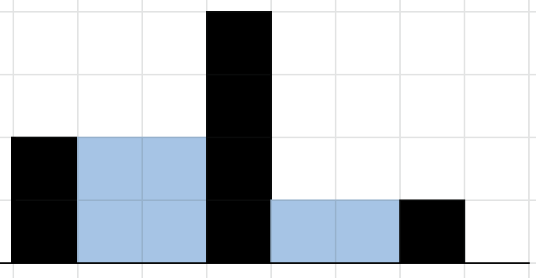

# 0x10. Rain

Here is the task I solve to practive interview excercise. The solution the task is on the file with the same name than the task.

My challenge for you is to try to solve all of this task and after see the way I did it.

#### 0. Rain
Given a list of non-negative integers representing the heights of walls with unit width 1, as if viewing the cross-section of a relief map, calculate how many square units of water will be retained after it rains.
- Prototype: `def rain(walls)`
- `walls` is a list of non-negative integers.
- Return: Integer indicating total amount of rainwater retained.
- Assume that the ends of the list (before index 0 and after index walls[-1]) are **not** walls, meaning they will not retain water.
- If the list is empty return `0`.

#### USAGE
```sh
$ ./0-main.py
6
6
```

Visual representation of the walls `[0, 1, 0, 2, 0, 3, 0, 4]`



Visual representation of the walls `[2, 0, 0, 4, 0, 0, 1, 0]`


